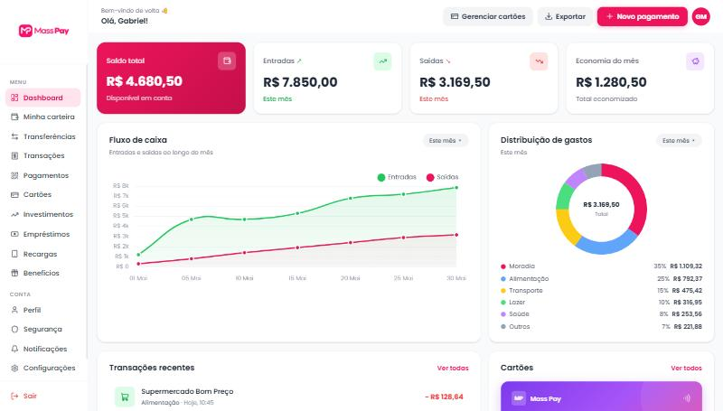

# MassPay

Plataforma de uma fintech fictícia que estou desenvolvendo ao longo do primeiro ano do curso de Análise e Desenvolvimento de Sistemas na FIAP. O projeto evolui por etapas: começa pelo front-end e depois recebe backend, banco de dados e APIs, conforme avanço no curso.

**Acesse:** https://gabrielmassimini.github.io/Projeto-Fintech-FIAP/



## Estágio atual

Até agora desenvolvi o **dashboard principal**, com layout responsivo. Ele mostra o resumo da conta, um gráfico de fluxo de caixa, a distribuição de gastos por categoria, as transações recentes, o cartão e os limites da conta. Os valores ainda são fictícios, porque o projeto não tem backend.

No celular, a barra lateral vira um menu que abre pelo botão ☰.


Também comecei a parte em Java, modelando as entidades do sistema (`Usuario`, `Conta`, `Cartao`, `Transacao`, `Investimento` e `Emprestimo`), que vão servir de base para o backend.

## Tecnologias usadas até aqui

- HTML
- CSS
- Tailwind CSS
- JavaScript
- Chart.js
- Java (modelagem das classes)

## Como rodar

Não precisa instalar nada. É só clonar o repositório e abrir o `index.html` no navegador (ou usar o Live Server do VS Code).

```bash
git clone https://github.com/GabrielMassimini/Projeto-Fintech-FIAP.git
```

## O que aprendi

- Montar um layout de dashboard responsivo com Grid e Flexbox e transformar a barra lateral em menu no celular.
- Criar gráficos de linha e de rosca com o Chart.js.
- Organizar o CSS com variáveis para manter as cores e os espaçamentos consistentes.
- Modelar entidades com orientação a objetos em Java (encapsulamento, construtores, getters e setters).
- Publicar o site no GitHub Pages. Aqui tive um problema: meus caminhos começavam com `/` (por exemplo, `/css/style.css`). Isso funcionava no meu computador, mas no GitHub Pages o site fica dentro de uma subpasta, e o CSS e o JavaScript não carregavam. Nessa etapa de revisão e publicação usei o Claude (IA) como mentor. Com ele entendi a diferença entre caminhos absolutos e relativos, reorganizei os arquivos e tirei o JavaScript de dentro do HTML.

## Próximos passos

- Banco de dados
- Backend em Java e APIs
- Dados reais no dashboard, no lugar dos valores fictícios
- Demais páginas da plataforma (carteira, transferências, cartões, investimentos, login e cadastro)

## Contato

Gabriel Massimini · [GitHub](https://github.com/GabrielMassimini) · [LinkedIn](https://www.linkedin.com/in/gabriel-massimini-junqueira/)
